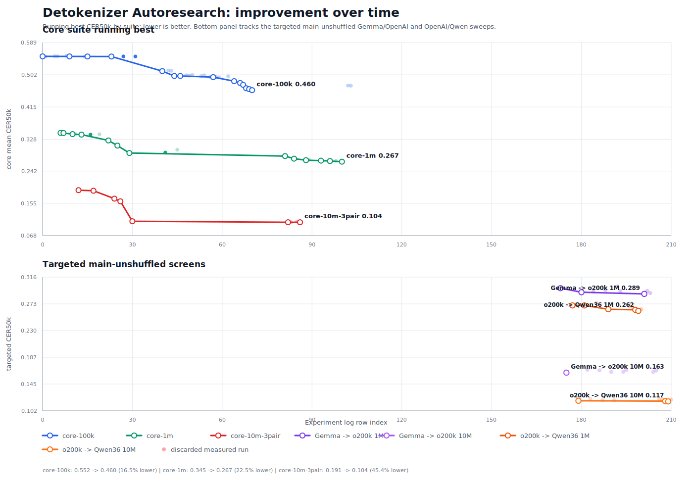

# Detokenizer Improvement Over Time

## Core Suites

| Suite | First accepted | Current best | Relative improvement |
|---|---:|---:|---:|
| `core-100k` | `0.551740` | `0.460496` | `16.5%` |
| `core-1m` | `0.345124` | `0.267432` | `22.5%` |
| `core-10m-3pair` | `0.190540` | `0.103947` | `45.4%` |

## Targeted Main-Unshuffled Screens

| Case | First unshuffled screen | Current best | Relative improvement |
|---|---:|---:|---:|
| Gemma -> o200k 1M | `0.298040` | `0.287500` | `3.5%` |
| Gemma -> o200k 10M | `0.162880` | `0.158260` | `2.8%` |
| o200k -> Qwen36 1M | `0.270540` | `0.261800` | `3.2%` |
| o200k -> Qwen36 10M | `0.117900` | `0.116900` | `0.8%` |
